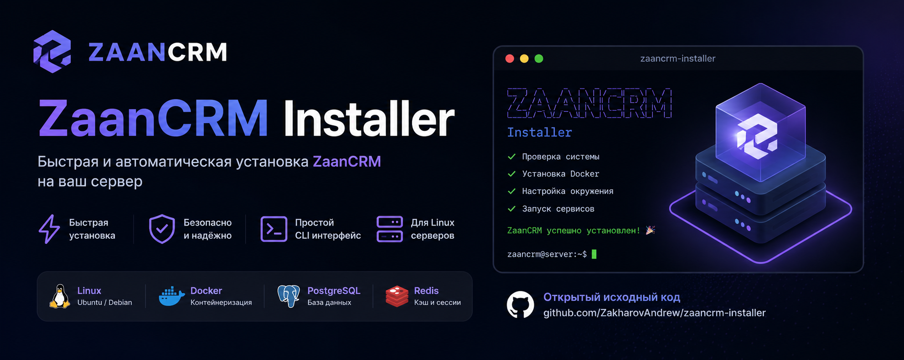

# 🦎 ZaanCRM Installer


  
[](LICENSE)
[](https://www.gnu.org/software/bash/)
[](https://www.yiiframework.com/)

**ZaanCRM Installer** – автоматический bash‑скрипт для развёртывания профессиональной CRM‑системы на базе Yii2 Basic.

Скрипт создаёт новый проект Yii2, устанавливает обязательные модули:
- `zakharov-andrew/yii2-user` – расширенное управление пользователями, RBAC, профили
- `zakharov-andrew/yii2-pages` – управление статическими страницами (CRUD + публичная часть)
- а также популярные расширения `bootstrap5`, `kartik/grid`, `kartik/select2`, `fontawesome` и другие (список ниже)

Затем настраивает подключение к базе данных (MySQL), выполняет миграции, создаёт учётную запись администратора и генерирует стандартные страницы.

## Требования

- **PHP** >= 7.4 (рекомендуется 8.1) с расширениями: `mbstring`, `xml`, `curl`, `zip`, `json`, `openssl`, `pdo`, `intl`, `gd`
- **Composer** (будет установлен автоматически, если отсутствует)
- **MySQL** >= 5.7 или MariaDB >= 10.2 (если не указывать `--skip-db`)
- **Git** (будет установлен автоматически, если отсутствует)
- **Bash** (Linux, macOS, WSL или Termux)

## Быстрая установка (одной строкой)

```bash
curl -fsSL https://raw.githubusercontent.com/ZakharovAndrew/zaancrm-installer/main/install.sh | bash
```

После запуска скрипт задаст несколько вопросов: параметры БД, пароль администратора и т.д. По окончании в текущей папке появится каталог ZaanCRM.

## Ручная установка

```bash
git clone https://github.com/ZakharovAndrew/zaancrm-installer.git
cd zaancrm-installer
bash install.sh --no-interactive --db-name mydb --admin-password secret
```

## Параметры командной строки

| Параметр | Описание | По умолчанию |
|----------|----------|---------------|
| `--project-dir PATH` | Каталог для установки | `./ZaanCRM` |
| `--db-host HOST` | Хост БД | `localhost` |
| `--db-port PORT` | Порт БД | `3306` |
| `--db-name NAME` | Имя базы данных | `zaancrm` |
| `--db-user USER` | Имя пользователя БД | `zaan_user` |
| `--db-password PASS` | Пароль БД | генерируется случайно |
| `--admin-email EMAIL` | Email администратора | `admin@zaancrm.com` |
| `--admin-username NAME` | Логин администратора | `admin` |
| `--admin-password PASS` | Пароль администратора | генерируется случайно |
| `--env ENV` | `dev` или `prod` | `dev` |
| `--no-interactive` | Не задавать вопросы, использовать значения по умолчанию/переданные | – |
| `--skip-db` | Пропустить создание БД и настройку подключения | – |
| `--skip-migrations` | Не выполнять миграции | – |
| `--skip-default-pages` | Не создавать стартовые страницы | – |
| `--demo-data` | Добавить демонстрационные данные | – |
| `-h, --help` | Показать справку | – |

Все параметры необязательны. В интерактивном режиме недостающие значения запрашиваются у пользователя.

## Примеры

### 1. Полностью автоматическая установка (для CI/CD)

```bash
bash install.sh \
  --no-interactive \
  --project-dir /var/www/zaancrm \
  --db-name zaancrm_prod \
  --db-user zaancrm \
  --db-password "StrongDBPass123" \
  --admin-email "ceo@mycompany.com" \
  --admin-password "AdminPass456" \
  --env prod
```

### 2. Установка без базы данных (только код и модули)

```bash
bash install.sh --skip-db --no-interactive
```

### 3. Установка с созданием демо-контента

```bash
bash install.sh --demo-data
```

## Что устанавливается?

### Базовый фреймворк
- `yiisoft/yii2-app-basic` (Yii2 Basic)

### Обязательные модули ZaanCRM
- `zakharov-andrew/yii2-user` – регистрация, авторизация, профили, RBAC
- `zakharov-andrew/yii2-pages` – создание и управление страницами (админка + публичная часть)
- `yiisoft/yii2-bootstrap5` – интерфейс на Bootstrap 5
- `yiisoft/yii2-fontawesome` – иконки
- `kartik-v/yii2-dialog` – модальные окна
- `kartik-v/yii2-grid` – продвинутые таблицы
- `kartik-v/yii2-widget-select2` – выпадающие списки с поиском

### Дополнительные модули (только в окружении `dev`)
- `yiisoft/yii2-debug`
- `yiisoft/yii2-gii`
- `yiisoft/yii2-faker`
- `yiisoft/yii2-httpclient`
- `yiisoft/yii2-authclient`
- `kartik-v/yii2-export`
- `kartik-v/yii2-mpdf`

## Структура после установки

```
ZaanCRM/
├── config/               # конфигурации приложения, БД, модулей
├── commands/             # консольные команды (UserController, PageController)
├── models/               # модели (расширяются модулями)
├── views/                # базовые шаблоны
├── web/                  # точка входа, assets, загрузки
├── runtime/              # кэш, логи, сессии
├── modules/              # внешние модули (если потребуются)
├── vendor/               # зависимости Composer
├── .env                  # переменные окружения (создаётся автоматически)
└── ...
```

После установки сразу доступны:
- Админка пользователей – `/user/user/index`
- Админка страниц – `/pages/pages/index`
- Публичные страницы – `/page/<slug>`
- Вход – `/login`, выход – `/logout`, регистрация – `/register`

## Управление проектом

**Запуск встроенного веб-сервера**  
```bash
cd ZaanCRM
php yii serve --port=8080
```

**Выполнение миграций вручную**  
```bash
php yii migrate/up
php yii migrate/up --migrationPath=@vendor/zakharov-andrew/yii2-user/migrations
php yii migrate/up --migrationPath=@vendor/zakharov-andrew/yii2-pages/migrations
```

**Создание нового администратора**  
```bash
php yii user/create <email> <password>
```

**Создание стандартных страниц (если не были созданы)**  
```bash
php yii page/create-default
```

## Устранение неполадок

### Ошибка «PHP extension … not found»
Установите недостающее расширение. Для Ubuntu/Debian:
```bash
sudo apt install php8.1-mbstring php8.1-xml php8.1-curl php8.1-zip php8.1-json php8.1-intl php8.1-gd
```

### Не удаётся создать базу данных
Убедитесь, что пользователь root MySQL имеет права и пароль введён верно. Можно создать БД вручную, а скрипт запустить с `--skip-db`, затем вручную настроить `config/db.php`.

### Ошибка прав на запись
Выполните после установки:
```bash
chmod -R 755 runtime web/assets web/uploads
```

## Вклад в проект

Предложения, pull request’ы и issue приветствуются.  
Пожалуйста, следуйте общим правилам оформления bash‑скриптов.

## Лицензия

MIT © Zakharov Andrey

---

🐊 **ZaanCRM** – делайте бизнес эффективнее вместе с Yii2!
